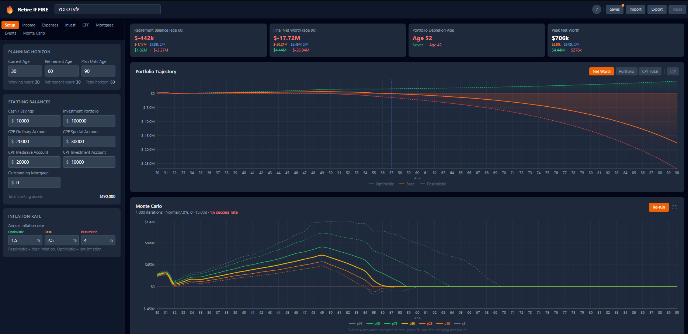
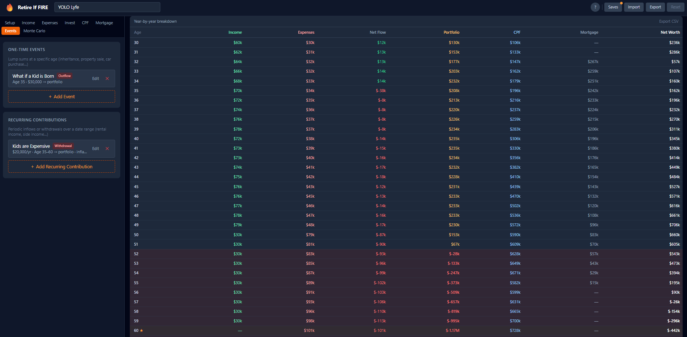

# 🔥 Retire If FIRE

A year-by-year retirement planning simulator. Model your income, expenses, investments, CPF, mortgage, and one-off events across a multi-decade horizon — with optimistic, base, and pessimistic projections, plus full Monte Carlo stochastic simulation.





---

## Quickstart

**Requirements:** Node.js 18+ (tested on 24 LTS)

**Windows**

A launch script is provided for PowerShell. From the project directory:

```powershell
.\launch_app.ps1
```

Then open **http://localhost:5173** in your browser.

The app loads with a sample plan. To try a different starting point, click **Saves** in the header and pick one of the built-in sample profiles. When you're ready to keep your work, open **Saves** again, enter a name, and click **Save**.

> If PowerShell blocks the script with an execution policy error, run once:
> ```powershell
> Set-ExecutionPolicy -Scope CurrentUser RemoteSigned
> ```

### Other environments

**macOS / Linux**

pnpm via corepack installs into a directory already on `PATH`, so no path manipulation is needed:
```bash
corepack enable
pnpm install
pnpm dev
```

**Command Prompt (cmd.exe)**
```cmd
set PATH=%USERPROFILE%\.corepack\bin;C:\Program Files\nodejs;%PATH%
pnpm dev
```

**PowerShell (manual, without the script)**
```powershell
$env:PATH = "$env:USERPROFILE\.corepack\bin;C:\Program Files\nodejs;" + $env:PATH
pnpm dev
```

---

## User Guide

The app is split into two panels: the **Editor** (left) where you configure your plan, and the **Results** (right) where projections update live. Editor tabs run left-to-right roughly in setup order.

### Setup tab

Set the three core ages that define your timeline:

- **Current age** — your starting point; simulation begins here
- **Retirement age** — the age at which your career income stops
- **End age** — how far into the future to project (e.g. 90 as a conservative lifespan)

Below the timeline, enter your **starting balances** for cash/savings, investment portfolio, and each CPF account (OA, SA, MA, and optionally the CPF Investment Account). These are the values the simulation seeds with on day one.

At the bottom of Setup, the **total assets** figure gives a quick sanity check of your starting net worth across all accounts.

---

### Income tab

Model your career earnings as a series of **income phases**, each covering a contiguous age range. Four phase types are available:

| Type | Behaviour |
|---|---|
| **Growth** | Income compounds at the configured rate each year — good for early career |
| **Plateau** | Income stays flat (zero growth) — useful for a stable mid-career period |
| **Taper** | Income shrinks each year (negative growth) — models winding down before retirement |
| **Retirement** | Produces zero earned income; acts as a placeholder for the post-work period |

Each phase has its own per-scenario growth rate, so optimistic and pessimistic projections can diverge from the same base income. Phases should cover your entire timeline without gaps; the engine uses the last active phase if ages overlap.

---

### Expenses tab

#### Recurring expenses

Add any ongoing cost as a recurring expense with an amount, frequency (monthly or annual), and optional age bounds. Leave start/end blank to apply the expense across the entire plan.

- **Inflation-linked** — the amount grows each year with the scenario's inflation rate
- **Custom escalation rate** — overrides inflation for that expense (e.g. healthcare costs rising faster than general inflation)

#### Percentage liabilities

Model proportional drains such as income tax or fund management fees as a percentage of either **gross income** or **portfolio value**, with optional age bounds.

---

### Investments tab

Configure how your portfolio grows each year. Two modes:

**Direct rate** — specify a single blended annual return per scenario (optimistic / base / pessimistic). Simple and fast to configure.

**Allocation mode** — specify separate equity and bond return rates, then define **allocation periods** (e.g. 80% equity from 30–55, 50% equity from 55–65, 30% equity from 65 onward). The engine computes the blended return from the equity fraction active at each age. This models a standard lifecycle glide path.

There is also a **safe withdrawal rate** toggle for retirement. When enabled, from your specified start age the engine draws down a fixed percentage of the portfolio each year as income, regardless of other income sources.

---

### CPF tab

Toggle CPF on to enable Singapore Central Provident Fund contributions and interest accrual.

**Contribution rates** — by default, the engine uses the statutory rates (which vary by age bracket). You can override these with custom employee and employer rates and custom OA/SA/MA allocation fractions.

**CPF interest** — OA, SA, and MA each accrue at their own rates (defaults: 2.5%, 4%, 4%). These compound annually and are recorded as separate account balances.

**CPF Investment Account (CPFIS)** — if you invest your OA savings in stocks or unit trusts via CPFIS, enable this and configure the expected annual return. The invested balance grows at market rates (not the 2.5% OA rate) and is included in total CPF net worth.

**CPF LIFE** — model Singapore's national annuity scheme:

- At your **RA creation age** (typically 55), specified amounts are drawn from your SA and OA into the Retirement Account. SA is drawn first; OA covers any shortfall up to the configured amount.
- From your **payout start age** (65–70), a monthly payout is added to income each year.
- Optionally, the payout can be **inflation-adjusted** to grow with cumulative inflation.

---

### Mortgage tab

Enable mortgage modelling to include home loan repayments in the simulation. Provide:

- **Principal**, **annual interest rate**, and **tenure** (years) — the engine computes the full amortization schedule automatically
- **Start age** — when the mortgage begins
- **CPF-OA fraction** — the proportion of each monthly repayment drawn from CPF-OA (0–1). The remainder comes from the investment portfolio.

---

### Events tab

#### One-time events

Add lump-sum cash flows at a specific age — inheritance, property sale proceeds, a large purchase, a holiday fund, etc. Positive amounts are inflows; negative amounts are outflows. Each event targets a specific account (portfolio, cash, CPF-OA, or CPF-SA).

#### Recurring contributions

Periodic inflows or withdrawals over an age range — rental income, a side business, planned annual gifts, structured withdrawals in early retirement. As with one-time events, negative values are withdrawals. Leave **End age** blank to run the contribution indefinitely.

---

### Annuities tab

Model fixed income streams that start at a defined age, such as a private annuity, pension, or CPF LIFE supplement. Each stream has:

- **Start age** and **annual amount**
- **Duration** — a fixed number of years, or "lifetime" (runs to plan end age)
- **Inflation-adjusted** — if on, the payout grows with cumulative inflation each year

---

### Monte Carlo tab

The deterministic three-scenario model assumes fixed growth rates. In reality, markets are volatile — a bad sequence of returns in the years just before or after retirement can devastate a portfolio even if the long-run average is fine. **Monte Carlo simulation** addresses this by running thousands of iterations, each with randomly sampled annual returns.

#### How it works

Each iteration simulates your entire plan from current age to end age. At every year, the portfolio return is drawn from a **Normal distribution** — `Normal(mean, σ)` — using the Box-Muller transform. Income, expenses, CPF, and mortgage follow the base-scenario deterministic values across all iterations; only portfolio growth is stochastic.

After all iterations complete, the net worth values at each age are sorted and **percentile bands** are extracted. The result is a fan chart showing the spread of possible outcomes.

#### Configuration

**Presets** — four historical reference points are provided as quick starting values:

| Preset | Mean return | Volatility (σ) | Based on |
|---|---|---|---|
| Global Stocks | 10% | 15% | MSCI World historical |
| Global Bonds | 4% | 6% | Global aggregate bond index |
| 60/40 Blend | 7.6% | 10% | 60% stocks / 40% bonds |
| Conservative | 5% | 8% | 40% stocks / 60% bonds |

All returns are **nominal** (not inflation-adjusted), matching the rest of the tool.

**Return distribution** — fine-tune the mean and volatility independently. A higher σ produces a wider fan; a lower σ compresses the bands toward the median.

**Iterations** — 500–1000 is a good balance of smoothness and speed. More iterations produce smoother percentile bands. Maximum is 5,000.

**Failure mode: Zero out failures** — when enabled (the default), any iteration that reaches a net worth of $0 or below is immediately marked as a failure and stays at $0 for all subsequent years. This reflects realistic financial ruin: once you've exhausted your assets, market recoveries don't help you. Disabling this allows failed runs to recover, which can make the lower percentiles look more optimistic than reality.

**Percentile lines** — toggle individual percentile lines on or off. The default set is p5, p25, p50, p75, p95. The chart uses a colour-coded scheme:

- **p50** (median) — thick yellow line; the central outcome
- **p25 / p75** — solid orange / green; the inner band
- **p10 / p90** — thin, lightly dashed orange / green; the mid-tail band
- **p1 / p5 / p95 / p99** — slate grey, dotted; the extreme tails

#### Running the simulation

Monte Carlo does **not** run automatically — it only runs when you click **Run Simulation** (or **Re-run** after a change). This keeps the UI responsive while you configure inputs. After changing any plan inputs, re-run the simulation to get updated results.

The chart header shows the **success rate**: the fraction of iterations in which net worth never reached zero. A rate ≥ 90% (shown in green) indicates a well-funded plan; 70–89% (amber) is moderate; below 70% (red) warrants attention.

Click the **expand icon** next to the Run button to pop the chart into a fullscreen overlay for easier reading.

---

### Results panel

The right panel updates live as you edit. It contains four sections:

**Summary cards** — at-a-glance milestones for the base scenario:

| Card | What it shows |
|---|---|
| Retirement balance | Net worth at your retirement age, with liquid portfolio and CPF breakdown |
| Peak net worth | The highest net worth reached and the age at which it occurs |
| Final balance | Net worth at plan end age |
| Depletion age | The age at which net worth first hits zero (shown only if the plan depletes) |

Each card also shows the optimistic and pessimistic values in smaller text below the base figure.

**Trajectory chart** — a multi-line chart plotting net worth across all three scenarios. Switch between metrics (Net Worth, Portfolio, CPF, Cash) using the buttons above the chart. Toggle **Lin / Log** to switch between linear and logarithmic Y-axis scale; log scale is useful for viewing early compounding growth on the same axis as large later values. Values ≤ 0 are clamped to 1 in log view.

**Monte Carlo chart** — the percentile fan chart described above. Only visible when Monte Carlo mode is enabled in the Monte Carlo tab.

**Year-by-year table** — a detailed annual breakdown showing income, expenses, CPF contributions, portfolio movements, and net worth for each year of the simulation. Switch between Optimistic, Base, and Pessimistic views using the tabs above the table.

---

### Saving and loading plans

Click **Saves** in the header to open the saves panel.

- **Save current plan** — give the plan a name and store it in a named slot. Saving to an existing name overwrites it.
- **Load a plan** — replaces the current plan with any saved or sample profile. If you have unsaved changes, you'll be asked to save, discard, or cancel.
- **Delete a save** — removes the slot.
- A small orange dot on the **Saves** button indicates unsaved changes.

Plans **auto-save** after every change, so your work is never lost between sessions. Named saves persist in `localStorage` across page reloads.

Use **Export** to download the current plan as a `.json` file (useful for backups or sharing). Use **Import** to load a `.json` file back. **Reset** returns to the default sample plan.

#### Sample profiles

Four starter profiles are included:

| Profile | Starting age | Retirement | Description |
|---|---|---|---|
| **Young Professional** | 25 | 60 | Aggressive 90% equity allocation, high salary growth trajectory, no CPF or mortgage |
| **Mid Career** | 40 | 65 | Balanced 60→30% equity glide path, CPF enabled with statutory rates |
| **Near Retirement** | 55 | 62 | Conservative 40→25% equity, small remaining mortgage, 3.5% safe withdrawal rate |
| **CPF Homeowner** | 32 | 65 | Active $450k HDB mortgage with 50% CPF-OA repayment, Singapore-focused setup |

---

## What it models

| Feature | Details |
|---|---|
| **Income phases** | Growth, plateau, taper, and retirement phases with per-scenario growth rates |
| **Expenses** | Time-bounded recurring expenses, optional inflation linking, custom escalation rates |
| **Percentage liabilities** | Tax, fund fees, etc. as % of gross income or portfolio value |
| **Portfolio growth** | Direct rate or equity/bond split with allocation periods that shift over time |
| **Safe withdrawal rate** | Classic 4%-rule-style drawdown in retirement |
| **CPF** | Full Singapore CPF statutory rates (OA/SA/MA), interest accrual, CPF-to-mortgage offset |
| **CPF Investment Account** | CPFIS-invested OA savings growing at market rates |
| **CPF LIFE** | RA creation at 55 drawing from SA then OA; lifetime payout from 65–70 |
| **Mortgage** | Amortization schedule auto-computed; CPF-OA fraction and cash split |
| **One-time events** | Lump-sum inflows/outflows at a specific age (inheritance, property purchase…) |
| **Recurring contributions** | Periodic inflows or withdrawals over a date range (rental income, side income…) |
| **Annuities / pensions** | Fixed income streams starting at a set age, with optional inflation adjustment |
| **Three scenarios** | Optimistic / Base / Pessimistic — all modelled simultaneously |
| **Monte Carlo simulation** | Stochastic fan chart from thousands of iterations with configurable return distribution |

---

## Project structure

```
src/
├── types/
│   ├── plan.ts          # All input data types
│   └── simulation.ts    # Output types (YearSnapshot, SimulationResult, MonteCarloResult)
├── engine/
│   ├── simulate.ts      # Main year-by-year simulation loop
│   ├── monteCarlo.ts    # Monte Carlo runner (Box-Muller sampling, percentile extraction)
│   ├── income.ts        # Income phase resolution
│   ├── expenses.ts      # Expense / liability resolution
│   ├── mortgage.ts      # Amortization table builder
│   ├── cpf.ts           # CPF statutory rates + contribution logic
│   └── growth.ts        # Portfolio growth rate resolver
├── store/
│   ├── planStore.ts     # Zustand store — mutations, saves, auto-save, MC trigger
│   └── defaultPlan.ts   # Sample plan pre-loaded on first launch
└── components/
    ├── layout/          # AppLayout, EditorPanel, ResultsPanel, SavesModal
    ├── editor/          # One tab component per section (incl. MonteCarloTab)
    ├── results/         # TrajectoryChart, MonteCarloChart, ResultsTable, SummaryCards
    └── ui/              # Reusable form primitives (incl. Modal)
public/
└── samples/             # Sample profile JSON files + index manifest
docs/
├── product_requirements_document.md
└── product_implementation_design.md
```

---

## Simulation model

Each year executes in a fixed order:

1. **Income** — resolve active career phase income
2. **CPF LIFE payout** — if LIFE is enabled and age ≥ payout start age, add annual payout to income; at RA creation age, draw SA then OA into the RA
3. **CPF contributions** — employee deduction + employer addition, split across OA/SA/MA
4. **Income tax / % liabilities** — applied to gross income
5. **Fixed expenses** — all active expense periods (inflated or escalated)
6. **Mortgage payment** — CPF-OA portion drawn first, remainder from portfolio
7. **One-time events** — lump sums applied to target accounts
8. **Recurring contributions** — periodic inflows/withdrawals
9. **Net cash flow** — settled into portfolio
10. **Portfolio growth** — blended equity/bond return applied (or sampled from Normal distribution in Monte Carlo mode)
11. **CPF IA growth** — if CPFIS is enabled, invested OA balance grows at market rate
12. **Safe withdrawal** — drawdown in retirement
13. **CPF interest** — OA/SA/MA accrue separately
14. **Annuities** — active annuity streams added to portfolio
15. Snapshot recorded

All monetary values are **nominal** (not inflation-adjusted). Expenses grow with inflation; the inflation rate itself is scenario-dependent.

---

## Tech stack

| | |
|---|---|
| Framework | React 18 + TypeScript |
| Build tool | Vite 5 |
| State | Zustand |
| Charts | Recharts |
| Styling | Tailwind CSS 3 |
| Package manager | pnpm (via corepack) |
